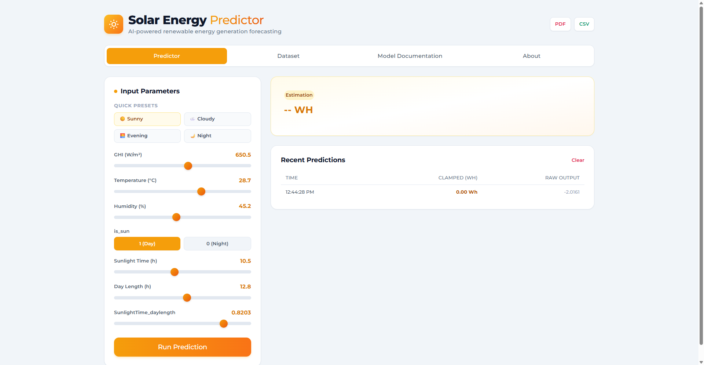
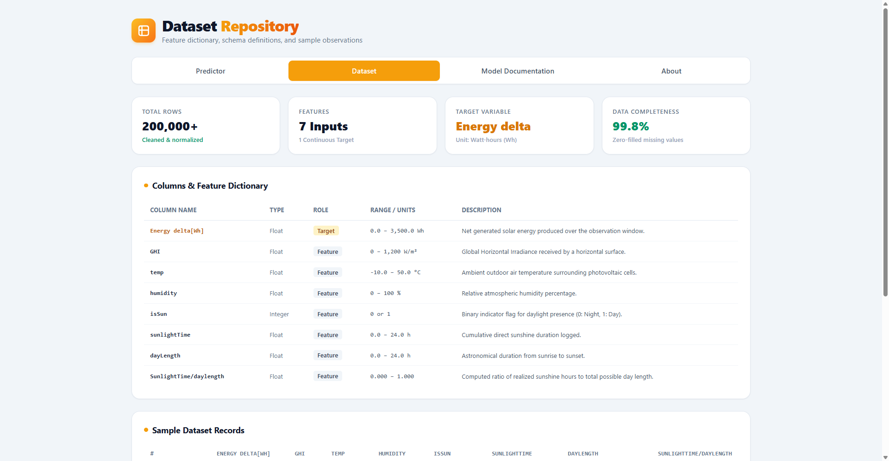
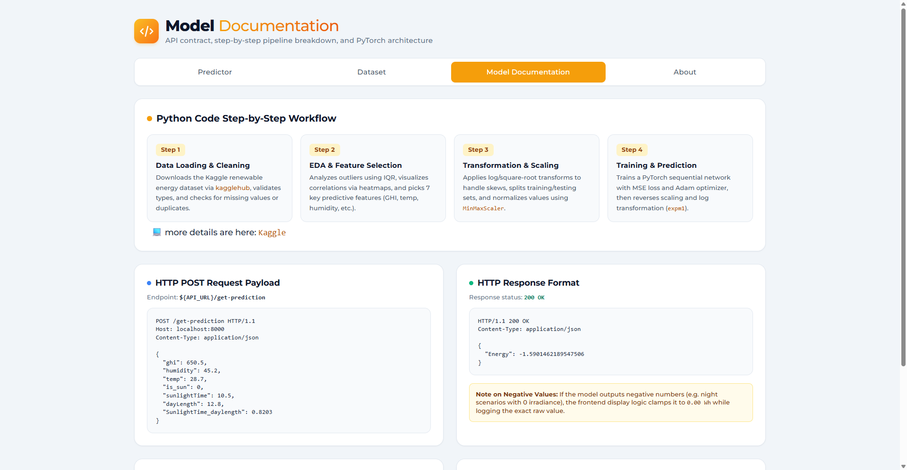

# ☀️ Solar Energy Predictor

**AI-powered renewable energy generation forecasting.**

Solar Energy Predictor is a web application that estimates the solar energy produced (in Watt-hours) based on more then **200K observations.**

---

## Table of Contents

- [Overview](#overview)
- [Features](#features)
- [Model](#model)
- [Workflow](#workflow)
- [API Reference](#api-reference)
- [Deployment (MLOps)](#deployment-mlops)
- [Project Structure](#project-structure)
- [Getting Started](#getting-started)
- [Author](#author)

---

## Overview

The project contains 200,000+ real observations collected in 2017. A neural network learns the relationship between irradiance, temperature, humidity and sunshine duration to predict the energy generated.

| Objective | Description |
|-----------|-------------|
| **Dataset & Feature Engineering** | .Apply Feature Engineering on 200K+ real observations collected from 2017. |
| **Neural Network Modeling** | An MLP for predicting solar energy output. |
| **Build Frontend & Backend** | Build a API with and User Interface. |
| **MLOps & CI/CD** | Automated deployment to Google Cloud Run following modern MLOps practices. |

---

## Features
### Predictor Section:
Here where we can get prediction based on features.
and here is input parameters:
#### Input Parameters

| Parameter | Example | Description |
|-----------|---------|-------------|
| `GHI` (W/m²) | 650.5 | Global Horizontal Irradiance |
| `Temperature` (°C) | 28.7 | Ambient air temperature |
| `Humidity` (%) | 45.2 | Relative humidity |
| `is_sun` | 1 (Day) / 0 (Night) | Daylight indicator |
| `Sunlight Time` (h) | 10.5 | Cumulative direct sunshine duration |
| `Day Length` (h) | 12.8 | Sunrise-to-sunset duration |
| `SunlightTime_daylength` | 0.8203 | Ratio of sunshine hours to day length |

---

<div align="center">
  
</div>


### Dataset Section:
In this section you will find the dataset documentation and Feature Dictionary.

#### Dataset
| Property | Value |
|----------|-------|
| Total rows | 200,000+ (cleaned & normalized) |
| Features | 7 inputs |
| Target | 1 continuous variable: `Energy delta[Wh]` |
| Data completeness | 99.8% (missing values zero-filled) |

#### Feature Dictionary

| Column | Type | Role | Range / Units | Description |
|--------|------|------|---------------|-------------|
| `Energy delta[Wh]` | Float | Target | 0.0 – 3,500.0 Wh | Net solar energy generated over the observation window |
| `GHI` | Float | Feature | 0 – 1,200 W/m² | Global Horizontal Irradiance on a horizontal surface |
| `temp` | Float | Feature | -10.0 – 50.0 °C | Ambient air temperature around the PV cells |
| `humidity` | Float | Feature | 0 – 100 % | Relative atmospheric humidity |
| `isSun` | Integer | Feature | 0 or 1 | Daylight flag (0: Night, 1: Day) |
| `sunlightTime` | Float | Feature | 0.0 – 24.0 h | Cumulative direct sunshine duration |
| `dayLength` | Float | Feature | 0.0 – 24.0 h | Astronomical duration from sunrise to sunset |
| `SunlightTime/daylength` | Float | Feature | 0.000 – 1.000 | Ratio of realized sunshine hours to total day length |

#### Sample Records

| # | Energy delta[Wh] | GHI | temp | humidity | isSun | sunlightTime | dayLength | SunlightTime/daylength |
|---|------------------|-----|------|----------|-------|--------------|-----------|------------------------|
| 1 | 0.00 | 0.0 | 1.6 | 100.0 | 0 | 0.0 | 450.0 | 0.000 |
| 2 | 0.00 | 0.0 | 1.6 | 100.0 | 0 | 0.0 | 450.0 | 0.000 |
| 5 | 0.00 | 0.0 | 1.7 | 100.0 | 0 | 0.0 | 450.0 | 0.000 |
| 9 | 0.00 | 0.0 | 1.9 | 100.0 | 0 | 0.0 | 450.0 | 0.000 |

<div align="center">
  
</div>

### Model Documentation Section:
Steps That I follow for creating this ML model.

#### Architecture (PyTorch)

```python
import torch.nn as nn

model = nn.Sequential(
    nn.Linear(in_features=7, out_features=12),
    nn.ReLU(),
    nn.Linear(in_features=12, out_features=7),
    nn.ReLU(),
    nn.Linear(in_features=7, out_features=1),
)
```

- **Loss:** MSE
- **Optimizer:** Adam

#### Preprocessing Pipeline

| Feature | Transform |
|---------|-----------|
| Energy | `log1p` |
| GHI | `log1p` |
| Humidity | `sqrt` |
| Sunlight | `log1p` |
| Day Length | `sqrt` |
| Scaler | MinMax `[0, 1]` |

Predictions are converted back to Watt-hours by reversing the scaling and applying `expm1`.

#### Workflow

1. **Data Loading & Cleaning** – Downloads the Kaggle renewable energy dataset via `kagglehub`, validates types, and checks for missing values and duplicates.
2. **EDA & Feature Selection** – Detects outliers using IQR, visualizes correlations with heatmaps, and selects 7 key predictive features.
3. **Transformation & Scaling** – Applies log/square-root transforms to reduce skew, splits train/test sets, and normalizes with `MinMaxScaler`.
4. **Training & Prediction** – Trains the PyTorch network (MSE + Adam), then reverses scaling and the log transform (`expm1`).

💻 More details on Kaggle: <a href="https://www.kaggle.com/code/abdellahkarani/explore-renewable-dataset/notebook">Kaggle</a>

---

#### API Reference

##### `POST /get-prediction`

**Endpoint:** `${API_URL}/get-prediction`

**Request**

```http
POST /get-prediction HTTP/1.1
Host: localhost:8000
Content-Type: application/json

{
  "ghi": 650.5,
  "humidity": 45.2,
  "temp": 28.7,
  "is_sun": 0,
  "sunlightTime": 10.5,
  "dayLength": 12.8,
  "SunlightTime_daylength": 0.8203
}
```

**Response** – `200 OK`

```http
HTTP/1.1 200 OK
Content-Type: application/json

{
  "Energy": -1.5901462189547506
}
```

> **Note on negative values:** the model can output small negative numbers (e.g. night scenarios with zero irradiance). The frontend clamps these to `0.00 Wh` for display while logging the exact raw value.


---

<div align="center">
  
</div>


### About Section:
Big Picture of Project.
<div align="center">
  
</div>


---


---

## Deployment (MLOps)

The project is deployed to **Google Cloud Run** through a **CI/CD** pipeline, following modern MLOps practices.


<div align="center">
  
</div>

---

## Project Structure

```
solar-energy-predictor/
├── frontend/        # Web UI (Predictor, Dataset, Model Docs, About)
├── backend/         # API serving the PyTorch model (/get-prediction)
├── notebooks/       # Feature engineering
├── dataset/       # The 200K Oberservations
├── model/           # Trained weights and scalers
```

---

## Getting Started

```bash
# 1. Clone the repository
git clone git@github.com:KaraniAbdellah/Solar_Energy_Prediction.git
cd Solar_Energy_Prediction/backend

# 2. Install backend dependencies
pip install -r requirements.txt

# 3. Run the API (default: http://127.0.0.1:8000)
uvicorn main:app --reload --port 8000

# 4. Open the frontend
cd ../frontend # run index.html in Live Server
```

---

## Author

 by **<a href="https://www.linkedin.com/in/abdellah-karani-965928294/">Abdellah Karani</a>.**
